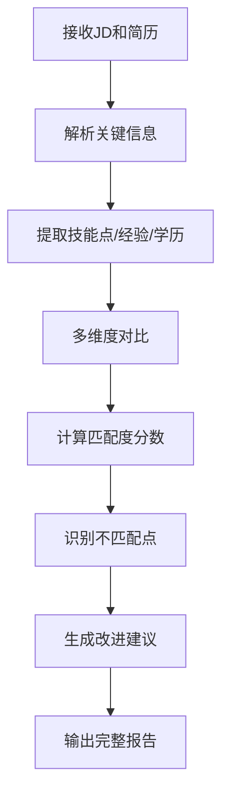

# Resume-JD Matcher Agent Skill

## 目的
根据岗位JD和简历，自动计算匹配度，分析不匹配点，并提出增加匹配度的修改意见。

## 核心能力

### 1. 输入处理
- **JD 解析**：从文本、PDF、DOC等格式提取关键信息
- **简历解析**：提取教育背景、工作经验、技能、项目经历等
- **格式支持**：纯文本、PDF、DOCX、图片中的文字

### 2. 匹配度分析维度

#### 硬技能匹配（权重40%）
- 必备技能点：JD中列出的技术要求
- 附加技能点：加分项技能
- 工具/平台熟悉度

#### 经验匹配（权重30%）
- 相关行业经验年限
- 类似岗位经验
- 项目管理经验
- 团队规模经验

#### 学历/证书匹配（权重15%）
- 学历要求匹配
- 专业背景相关性
- 认证证书匹配

#### 软技能/文化匹配（权重15%）
- 沟通能力
- 团队协作
- 语言能力
- 企业文化适配度

### 3. 输出分析报告

#### 匹配度总分（0-100分）
- 整体匹配度
- 各维度得分明细

#### 不匹配点分析
- **严重不匹配**（红色）：必须满足的要求缺失
- **中度不匹配**（黄色）：加分项缺失或经验不足
- **轻微不匹配**（蓝色）：可优化项

#### 具体建议
- **简历修改建议**：
  - 关键词优化
  - 经验描述重构
  - 技能突出展示
  - 格式排版建议

- **能力提升建议**：
  - 推荐学习的技能
  - 建议获取的证书
  - 项目经验补充方向

### 4. 工作流程



## 使用方式

### 直接对话
```
"请分析这个JD和简历的匹配度"
"这是我的简历和岗位JD，请帮我看看哪里不匹配"
"根据这个JD，我的简历应该怎么修改"
```

### 文件上传
- 上传JD文件（PDF/DOCX/图片）
- 上传简历文件（PDF/DOCX/图片）
- 系统自动解析并对比

## 配置要求

### 模型
- 推荐：多模态大模型（如火山引擎 Doubao-Seedream-4.5）
- 替代：GPT-4、Claude 3、文心一言

### 工具支持
- 文件解析工具（PDF解析）
- 文本处理工具
- 数据格式化工具
- 可选：图表生成工具（用于可视化匹配度）

## 示例输出模板

```
# 简历-JD匹配度分析报告

## 整体匹配度：78/100 ⭐⭐⭐⭐

### 各维度得分
- 硬技能匹配：85/100 ✅ 优秀
- 经验匹配：70/100 ⚠️ 可提升
- 学历/证书匹配：90/100 ✅ 优秀
- 软技能匹配：65/100 ⚠️ 需优化

### 🔴 严重不匹配点
1. **Python爬虫经验不足**
   - JD要求：3年以上Python爬虫开发经验
   - 简历显示：1年相关经验
   - 建议：补充爬虫项目经验或强调相关技能迁移能力

2. **分布式系统经验缺失**
   - JD要求：熟悉分布式系统架构
   - 简历显示：无相关经验
   - 建议：学习并补充相关理论知识和项目实践

### 🟡 中度不匹配点
1. **团队管理经验不足**
   - JD优先：有10人以上团队管理经验
   - 简历显示：5人团队管理经验
   - 建议：突出团队管理方法论和成果

### 🟢 可优化点
1. **技能关键词优化**
   - 建议在技能部分增加：微服务、容器化、CI/CD等关键词

2. **项目描述重构**
   - 增加量化成果：提升效率XX%、降低成本XX%

### 📝 简历修改建议
1. **技能部分**：
   - 将Python爬虫经验提前展示
   - 增加分布式系统的学习意向

2. **工作经验**：
   - 突出5人团队管理的具体成果
   - 增加项目规模和复杂度描述

3. **格式优化**：
   - 使用关键词加粗
   - 增加项目数据可视化描述
```

## 高级功能

### A/B测试支持
- 同一份JD，不同版本简历对比
- 同一份简历，不同JD匹配度分析

### 行业基准
- 岗位平均要求分析
- 行业薪资水平参考
- 竞争力评估

### 持续跟踪
- 简历修改迭代跟踪
- 匹配度提升曲线
- 面试通过率预测

## 更新日志
- v1.0 (2026-04-07): 初始版本创建
```

这个技能文件定义了你的简历-JD匹配度分析agent的全部能力。我可以帮你实现这个agent，你想要先从哪个功能开始？